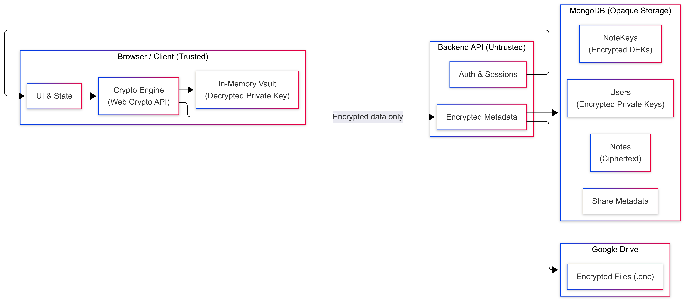

  <a href="https://github.com/buggy-bits/zero-vault">
    <picture>
      
    </picture>
  </a>

<h3 align="center">ZeroVault</h3>

A cryptographically enforced zero-knowledge system for encrypted notes and file sharing.

## Overview

ZeroVault is a privacy-first full-stack application for creating, storing, and sharing encrypted notes and files using a **zero-knowledge architecture**.

All encryption and decryption happens inside the browser.  
The backend is intentionally blind: it stores encrypted data, manages authentication, and facilitates sharing — but it never has the capability to read user data.

If the database, backend server, or cloud storage is compromised, user content remains confidential by design.

This project focuses on **doing cryptography-backed system design correctly**, rather than maximizing features or convenience.

## Why ZeroVault Exists

Many applications claim to be “secure” or “end-to-end encrypted” while still relying on server-side key access, recoverable secrets, or trust-based permissions.

ZeroVault explores a stricter model:

- The server is removed from the trust boundary
- Access is enforced cryptographically, not logically
- Keys belong to users, not infrastructure
- Loss of password means loss of access (intentionally)

The goal is not theoretical cryptography, but **practical zero-knowledge system design using real web technologies**.

## Zero-Knowledge Guarantees

ZeroVault enforces the following guarantees throughout the system:

- Plaintext notes and files never leave the browser
- Private keys are never stored or transmitted in plaintext
- Encryption keys are never generated or derived server-side
- The backend cannot decrypt data even with full database access
- Sharing does not involve password exchange or data re-encryption

These guarantees are enforced by architecture, not policy.

## High-Level Architecture

The system is built around explicit trust boundaries.

- **Browser (trusted for secrets)**  
  Key generation, encryption, decryption, vault management

- **Backend API (untrusted for secrets)**  
  Authentication, encrypted metadata storage, sharing coordination

- **Database (untrusted storage)**  
  Encrypted notes, encrypted keys, metadata only

- **Google Drive (encrypted blob storage)**  
  Encrypted files stored in the user’s own Drive account

  

Plaintext exists **only** in browser memory while the vault is unlocked.

## Cryptographic Model (Short)

ZeroVault uses a hybrid encryption model:

- **AES-256-GCM** for encrypting notes and file contents
- **ECDH (P-256)** for encrypting Data Encryption Keys (DEKs)
- **PBKDF2** for deriving keys from user passwords

Each note or file has its own unique DEK.  
Sharing is implemented by **re-encrypting the DEK**, not the data.

Private keys are encrypted with password-derived keys and stored only in encrypted form.

## Vault Lock / Unlock Model

ZeroVault introduces an explicit **vault** concept on the client.

- Authenticated users may still have a locked vault
- Decrypted private keys exist only in memory
- Page refresh immediately locks the vault
- Unlocking requires re-entering the password

This behavior is intentional and mirrors how dedicated security tools operate.

## Core Features

### Encrypted Notes
- Client-side encryption
- Unique key per note
- Secure sharing via key re-encryption
- Soft deletion with cryptographic revocation

### Encrypted File Storage
- Client-side encryption before upload
- Encrypted files stored in Google Drive
- Dedicated ZeroVault folder per user
- Secure streaming and local decryption

### Secure Sharing
- Public-key-based sharing
- No password exchange
- No file duplication
- Share links have no cryptographic power

### Access Revocation
- Notes: soft delete + key revocation
- Files: hard delete + Drive cleanup
- Immediate loss of decryptability

## Authentication vs Cryptographic Access

Authentication in ZeroVault identifies **who** a user is.

Cryptography determines **what** a user can read.

JWTs and cookies are used only to fetch encrypted data and metadata.  
Possession of encrypted content alone is useless without the correct private key.

## Threat Model

### Protected Against
- Database leaks
- Backend compromise
- Insider access to infrastructure
- Cloud storage exposure

### Not Protected Against
- Compromised user devices
- Malicious browser extensions
- Weak user passwords
- Keylogging malware

These limitations are explicit and intentional.

## Tech Stack

**Frontend**
- React + TypeScript
- Web Cryptography API
- In-memory vault management

**Backend**
- Node.js + Express
- JWT authentication (HTTP-only cookies)
- Zero crypto logic

**Storage**
- MongoDB for encrypted metadata
- Google Drive API encrypted files

## Further Reading

For a detailed, beginner-friendly deep dive into project, see the accompanying article:

**👉 [Building ZeroVault: A Zero-Knowledge Notes & File Sharing System](https://medium.com/@saigadangi/building-a-zero-knowledge-notes-file-sharing-app-zerovault-02315135a5d4)**

## Contributing

Contributions are welcome.

## License

MIT License

<strong>Built with intention, not shortcuts.</strong>

