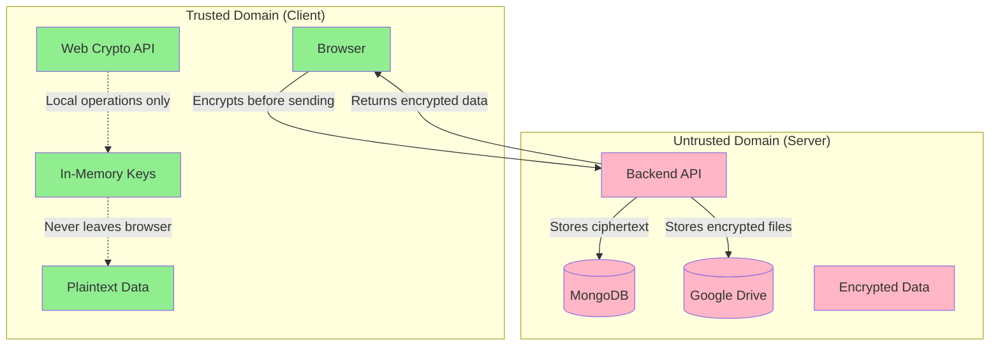
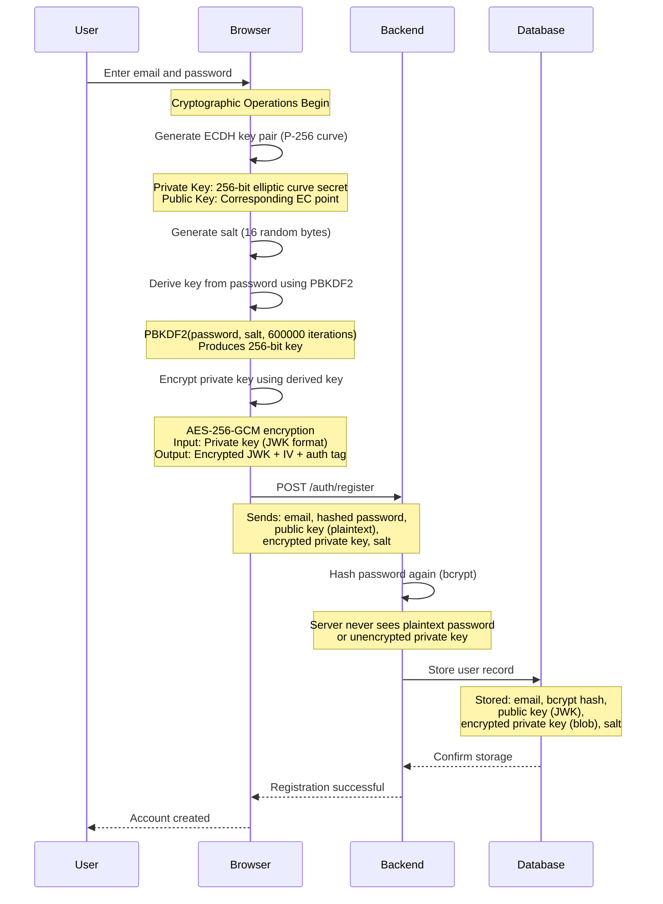
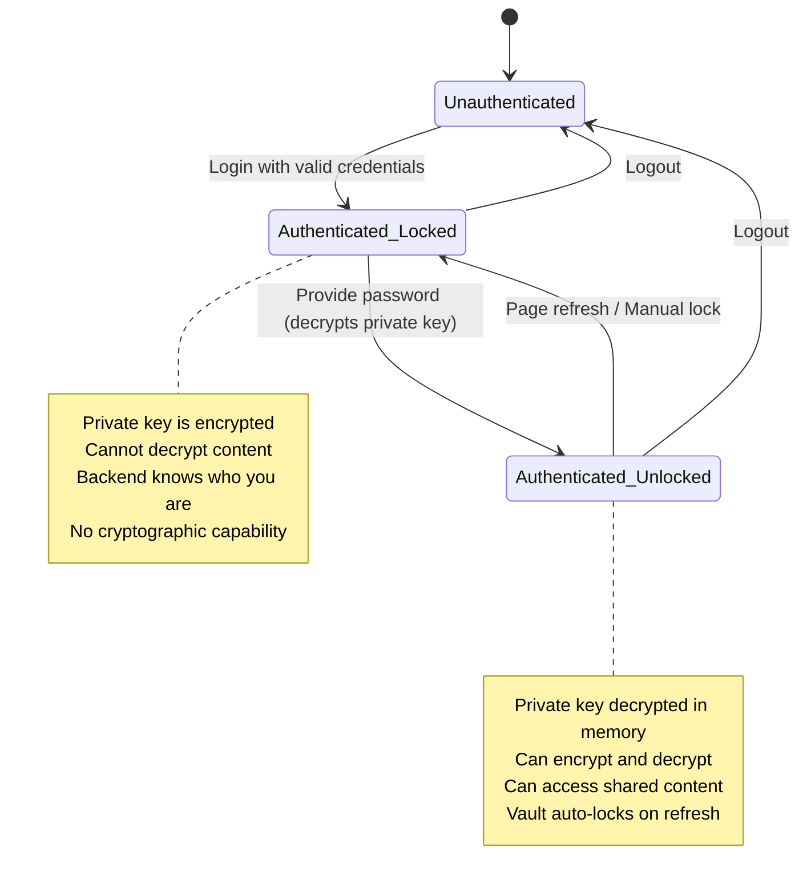
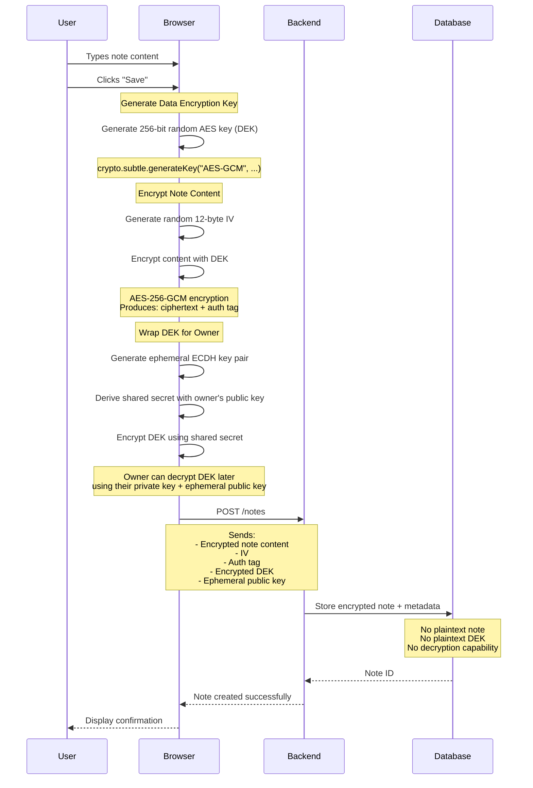
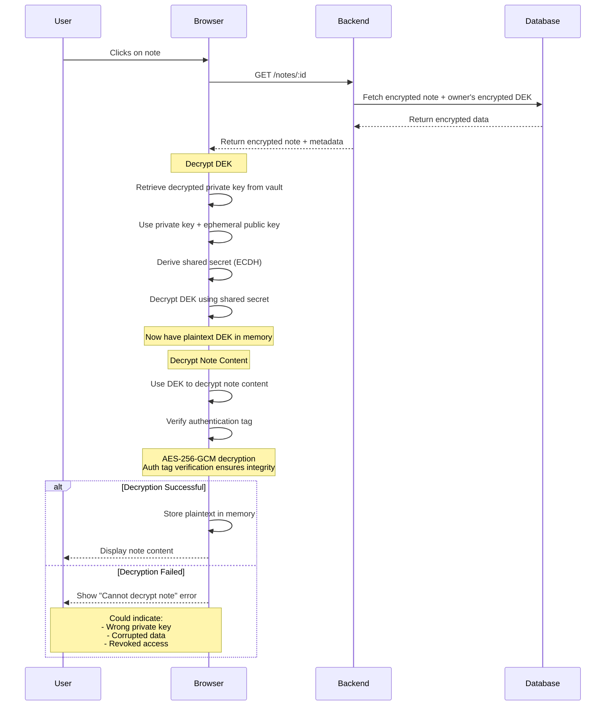
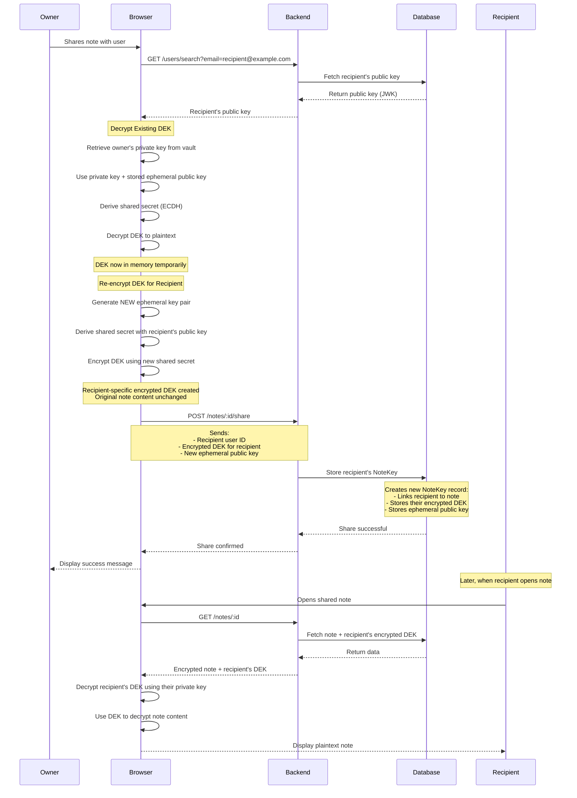
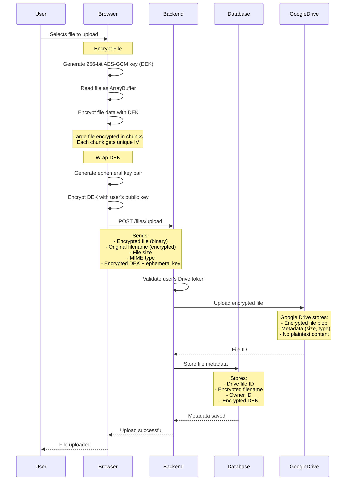
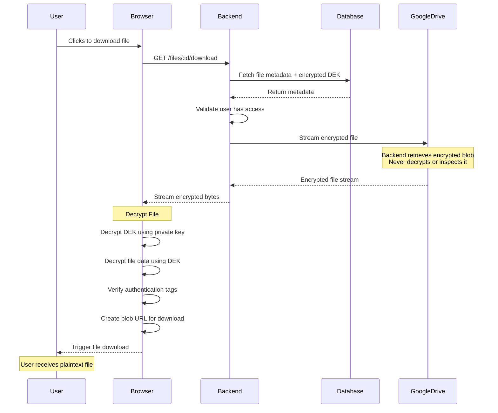

# ZeroVault

**A cryptographically enforced zero-knowledge system for encrypted notes and file sharing**

ZeroVault is a full-stack application where the server is mathematically incapable of reading your data. Not because we trust it, not because we promise not to look, but because the cryptographic architecture makes it impossible. Every piece of data is encrypted in your browser before transmission, and the server never possesses the keys required to decrypt anything.

This project exists at the intersection of applied cryptography, web security, and distributed systems design. It's built to answer a single question: what does it actually take to build a production-grade zero-knowledge system using modern web technologies?

---

## What Is This Project?

ZeroVault is an encrypted note-taking and file-sharing platform where confidentiality is enforced through cryptography rather than trust. Users can create text notes, upload files, and share them with other users—all while maintaining the guarantee that the backend infrastructure never sees plaintext content.

The system implements client-side encryption using the Web Cryptography API, hybrid encryption schemes combining symmetric and asymmetric cryptography, and a vault-based key management model that separates authentication from cryptographic capability. Files are stored encrypted in the user's own Google Drive, and sharing is achieved through cryptographic key re-encryption rather than traditional access control lists.

From a technical perspective, ZeroVault demonstrates how to build a secure multi-user system where the server acts purely as encrypted storage and coordination infrastructure. The backend authenticates users, stores ciphertext, and facilitates encrypted key exchange—but it never participates in encryption or decryption operations.

---

## Why This Project Exists

Most applications that claim to provide "secure storage" still require users to trust the server. Encryption might exist, but it often happens server-side, with keys stored in environment variables, hardware security modules, or key management services controlled by the service provider. This creates several fundamental problems:

A database breach can expose user data because encrypted data and encryption keys are often stored in the same infrastructure. An insider with sufficient system access—whether a developer, administrator, or third-party contractor—can potentially decrypt content. Bugs in permission logic can accidentally expose data to unauthorized users. Compliance with government requests or legal orders requires the service provider to decrypt and hand over user data.

The promise of "encrypted storage" becomes meaningless if the entity storing your data also holds the keys to decrypt it. This is not a theoretical concern—it's a pattern that has failed repeatedly in real-world breaches.

ZeroVault was built to explore a fundamentally different model: zero-knowledge architecture, where the server is deliberately excluded from the trust boundary. The system is designed with the assumption that backend infrastructure may be compromised, inspected, or compelled to produce data at some point in the future. By ensuring the server never possesses usable decryption keys, the system remains secure even under these adverse conditions.

This project also serves as a learning vehicle for understanding how cryptographic systems work in practice. Most educational resources on encryption focus on individual algorithms or theoretical properties. Very few show how to combine symmetric encryption, asymmetric key exchange, password-based key derivation, and secure session management into a cohesive system that actually works.

---

## Understanding Zero-Knowledge Architecture

The term "zero-knowledge" is frequently misused in the software industry. In ZeroVault, it has a precise technical meaning: the server has zero knowledge of the plaintext content it stores and facilitates sharing for.

At its core, zero-knowledge architecture is about designing systems where servers handle encrypted data without ever gaining the capability to decrypt it. This is achieved through careful separation of cryptographic responsibilities, explicit trust boundaries, and architectural choices that prioritize security over convenience.

### The Fundamental Principle

In a traditional client-server application, the server is trusted with both data and the means to process it. Users authenticate, the server verifies credentials, and once authenticated, the server has full access to user data. Security relies on perimeter defense—keeping attackers out of the system.

In a zero-knowledge system, the server is deliberately kept powerless. It authenticates users to establish identity, but authentication does not grant the server access to plaintext data. Instead, all cryptographic operations occur on the client. The server stores encrypted artifacts and mediates access to them, but it never participates in encryption or decryption.

This architectural shift has profound implications:

**Trust boundaries become explicit** — You don't need to trust the server operator, the database administrator, or the cloud provider with your data confidentiality. You only need to trust the cryptographic algorithms and your client device.

**Breaches have limited impact** — If the database is leaked or the backend is compromised, the attacker obtains only encrypted data without the means to decrypt it.

**Compliance and legal exposure change** — The service provider cannot decrypt user data even if legally compelled to do so, because they don't possess the necessary keys.

### How Zero-Knowledge Is Enforced in ZeroVault

ZeroVault implements zero-knowledge through several architectural constraints that are enforced throughout the system:

**All encryption and decryption happens client-side** — The browser uses the Web Cryptography API to perform all cryptographic operations. The backend never calls encryption functions, never derives keys, and never transforms ciphertext into plaintext.

**Private keys never leave the client in plaintext** — When you create an account, your private key is generated in the browser. Before being sent to the server for backup, it's encrypted using a key derived from your password. The server stores this encrypted private key but has no way to decrypt it.

**Data encryption keys are wrapped, not shared** — Each note or file is encrypted with its own unique symmetric key. These keys are never sent to the server in plaintext. Instead, they're encrypted using the recipient's public key before storage.

**The server enforces ownership, not access** — The backend verifies that you own a resource before returning its encrypted form, but ownership doesn't grant the server the ability to read content. You must still possess the correct cryptographic key to decrypt it.

**Session tokens authenticate identity, not data access** — Your session cookies tell the server who you are, allowing it to fetch your encrypted data. But having a valid session doesn't mean you can decrypt anything until you unlock your vault by providing your password.

### Visual Representation of Trust Boundaries


The green area represents the trusted domain where plaintext data and decryption keys exist. The red area represents untrusted infrastructure that only ever sees encrypted data. Data crosses this boundary only in encrypted form, and keys that could decrypt it never leave the trusted domain.

---

## Zero-Knowledge Architecture vs End-to-End Encryption

While these terms are sometimes used interchangeably, they describe different security models with distinct guarantees and trade-offs.

### End-to-End Encryption (E2EE)

End-to-end encryption ensures that data is encrypted on the sender's device and remains encrypted until it reaches the intended recipient's device. The defining characteristic is that intermediate servers—even those operated by the service provider—cannot decrypt the data in transit.

E2EE is commonly implemented in messaging applications like Signal or WhatsApp. When you send a message, it's encrypted on your device using the recipient's public key. The message travels through servers in encrypted form and is decrypted only on the recipient's device. The server facilitates delivery but cannot read message content.

However, E2EE alone doesn't necessarily prevent the server from having access to encryption keys or metadata. Many E2EE systems still trust the server to:

- Generate and distribute encryption keys
- Manage user key directories
- Facilitate key exchange protocols
- Store encrypted data with server-side knowledge of encryption schemes

The server might not be able to read data *in transit*, but it may still have architectural capabilities that could be exploited to compromise confidentiality under certain conditions.

### Zero-Knowledge Architecture

Zero-knowledge architecture goes further by ensuring the server never gains cryptographic capability at any point—not during transmission, not during storage, and not during key management.

In a zero-knowledge system:

**Key generation happens entirely client-side** — The server never generates encryption keys and never has access to the randomness used to create them.

**The server cannot authenticate cryptographically** — Even with full database access, the server cannot prove it possesses valid decryption keys or impersonate users cryptographically.

**Encrypted storage is opaque** — The server stores encrypted data but doesn't know the encryption scheme, key derivation parameters, or have any metadata that would help break encryption.

**Recovery is impossible without user secrets** — If a user forgets their password, their data is permanently inaccessible. This is not a failure—it's a feature that proves the system's zero-knowledge property.

### Practical Differences in ZeroVault

Let's illustrate this with a concrete example. Imagine a note-sharing scenario:

**In a typical E2EE system:**
1. Alice writes a note on her device
2. The note is encrypted before transmission
3. The server receives the encrypted note
4. When Bob requests the note, the server might decrypt it using server-held keys and re-encrypt it for Bob
5. Bob receives and decrypts the note

The server facilitates E2EE by managing keys and performing cryptographic operations on behalf of users.

**In ZeroVault's zero-knowledge model:**
1. Alice writes a note in her browser
2. Her browser generates a random Data Encryption Key (DEK)
3. The note is encrypted with the DEK using AES-256-GCM
4. The DEK is encrypted using Alice's public key
5. Both encrypted note and encrypted DEK are sent to the server
6. When Alice shares with Bob, her browser decrypts the DEK using her private key
7. Her browser re-encrypts the DEK for Bob using his public key
8. The server stores this newly encrypted DEK without ever seeing the plaintext DEK
9. When Bob opens the note, his browser decrypts his copy of the DEK and then decrypts the note

The server never sees the DEK in plaintext and never participates in encryption or decryption. It's a blind courier moving encrypted artifacts between parties.

### Why This Distinction Matters

The difference between E2EE and zero-knowledge architecture determines what happens during a server compromise:

**With E2EE alone:** An attacker who compromises the server might gain access to key management infrastructure, allowing them to intercept future communications or impersonate users to obtain keys.

**With zero-knowledge architecture:** An attacker who compromises the server obtains only encrypted data and encrypted keys. Without user passwords or private keys, this data remains cryptographically secure.

Zero-knowledge architecture provides stronger guarantees but comes with trade-offs: no password recovery, no server-side search, and increased complexity for users and developers.

---

## The Cryptographic Architecture

Understanding how ZeroVault works requires diving into the specific cryptographic operations that make zero-knowledge guarantees possible.

### User Registration and Key Generation

When you create an account, several cryptographic operations occur in sequence:


This flow establishes several critical properties:

**The server never sees your plaintext private key** — It's encrypted in the browser before transmission using a key derived from your password.

**Your password is hashed twice** — Once in the browser for key derivation, and again on the server for authentication. These are separate operations with separate purposes.

**Your public key is stored in plaintext** — This is safe because public keys are designed to be shared. Other users need access to your public key to share content with you.

**The salt is stored but not secret** — The salt is needed to derive the same key from your password during login. Storing it doesn't weaken security because PBKDF2's security relies on computational cost, not salt secrecy.

### Password-Based Key Derivation

Passwords are poor encryption keys. They're human-memorable, which means they have low entropy. Using a password directly as an encryption key would make encrypted data vulnerable to brute-force attacks.

PBKDF2 (Password-Based Key Derivation Function 2) solves this by making key derivation computationally expensive:
```javascript
// Conceptual representation
const salt = crypto.getRandomValues(new Uint8Array(16));

const derivedKey = await crypto.subtle.deriveKey(
  {
    name: "PBKDF2",
    salt: salt,
    iterations: 600000,  // 600,000 iterations
    hash: "SHA-256"
  },
  passwordKey,
  { name: "AES-GCM", length: 256 },
  false,  // Key not extractable
  ["encrypt", "decrypt"]
);
```

The high iteration count means each password guess takes approximately 0.5-1 second on typical hardware. This doesn't noticeably impact legitimate use (you only unlock your vault occasionally), but it makes brute-force attacks prohibitively expensive.

An attacker who obtains your encrypted private key from the database would need to try hundreds of thousands of iterations for each password guess. Even with specialized hardware, cracking a strong password becomes impractical.

### The Vault Lock/Unlock Mechanism

The vault is a client-side concept that represents whether your private key is currently decrypted and held in browser memory.


When you log in, the backend returns your encrypted private key. At this point, you're authenticated but cryptographically powerless. The vault remains locked.

To unlock the vault, you must re-enter your password. The browser uses this password to derive the same key that was used during registration, attempts to decrypt your private key, and if successful, holds the decrypted key in memory.

This decrypted key never touches localStorage, sessionStorage, or IndexedDB. It exists only in JavaScript memory, typically inside a React context. When you refresh the page, this memory state is destroyed, and the vault automatically locks.

This might seem inconvenient, but it's a deliberate security choice. Persistent storage mechanisms in browsers are vulnerable to XSS attacks, malicious browser extensions, and other client-side compromises. By keeping the decrypted key ephemeral, ZeroVault limits the window of exposure.

### Note Encryption Flow

When you create a note, the encryption process involves multiple steps, each serving a specific security purpose:


Let's break down why each step matters:

**Generating a unique DEK per note** — Each note gets its own encryption key. If one key is somehow compromised, only that specific note is affected. This is called key isolation.

**Using AES-256-GCM** — GCM mode provides both confidentiality (encryption) and integrity (authentication). The authentication tag ensures that any tampering with the ciphertext will be detected during decryption.

**Encrypting the DEK with asymmetric crypto** — The DEK is encrypted using your public key (via ECDH key exchange). This means only your private key can decrypt it. The server stores the encrypted DEK but can't use it.

**Using ephemeral key pairs** — Instead of encrypting the DEK directly with your long-term public key, ZeroVault generates a temporary key pair for each encryption operation. This provides forward secrecy—even if your long-term private key is compromised in the future, previously encrypted DEKs remain secure.

### Note Decryption Flow

When you open a note, decryption reverses the encryption process:


Decryption can only succeed if:

1. You possess the correct private key (vault must be unlocked)
2. An encrypted DEK exists for your user
3. The encrypted note data is intact and unmodified
4. The authentication tag verifies successfully

If any of these conditions fail, decryption fails gracefully without revealing partial plaintext.

### Sharing and Key Re-Encryption

Sharing is where zero-knowledge architecture becomes particularly interesting. Traditional systems implement sharing by updating access control lists on the server. ZeroVault implements sharing through cryptographic key re-encryption.


This process has several important properties:

**The note content is never re-encrypted** — Only the symmetric key is re-encrypted. The actual content remains unchanged, which is efficient for large notes or files.

**The server never sees the plaintext DEK** — During sharing, the browser decrypts the DEK, then immediately re-encrypts it for the recipient. The plaintext DEK exists in memory only briefly and is never transmitted.

**Each recipient gets their own encrypted DEK** — Even if 10 users share the same note, there are 10 different encrypted DEKs stored. Revoking access for one user doesn't require re-encrypting for others.

**Forward secrecy is maintained** — Each sharing operation uses a new ephemeral key pair. If someone's long-term private key is compromised, previously shared keys remain protected.

### File Encryption and Google Drive Integration

Files use the same cryptographic model as notes but with different storage infrastructure. Files can be large (megabytes or gigabytes), so storing them in MongoDB isn't practical. Instead, encrypted files are stored in the user's Google Drive.


When downloading a file:


The backend acts as a streaming proxy but never sees plaintext content. Google Drive never sees plaintext content. Only the browser has access to the decrypted file.

### Asymmetric Cryptography with ECDH

ZeroVault uses Elliptic Curve Diffie-Hellman (ECDH) for asymmetric operations. Unlike RSA, which directly encrypts data with public keys, ECDH is a key agreement protocol.

Here's how it works conceptually:

**Key Generation:**
- Each user has a long-term key pair: a private scalar and a public point on an elliptic curve (P-256)
- The private key is a 256-bit random number
- The public key is a point on the curve derived from the private key

**Encrypting Data (Wrapping a DEK):**
1. Generate an ephemeral key pair (temporary private and public keys)
2. Use your ephemeral private key and the recipient's public key to derive a shared secret
3. Use this shared secret as a symmetric key to encrypt the DEK
4. Send the encrypted DEK along with your ephemeral public key

**Decrypting Data (Unwrapping a DEK):**
1. Receive the encrypted DEK and the sender's ephemeral public key
2. Use your private key and the sender's ephemeral public key to derive the same shared secret
3. Use this shared secret to decrypt the DEK

The beautiful property of ECDH is that both parties derive the same shared secret without ever transmitting it. The mathematics of elliptic curves ensures that:
```
(Your Private Key × Their Public Key) = (Their Private Key × Your Public Key)
```

This shared secret is then used with AES-GCM to actually encrypt the DEK.

### Other Cryptographic Operations

Beyond the core encryption flows, several other cryptographic operations occur throughout the system:

**Password Hashing for Authentication** — User passwords are hashed with bcrypt on the server for authentication. This is separate from PBKDF2 key derivation. Bcrypt is used because it's a slow, adaptive hashing function designed specifically for password storage.

**HMAC for Token Signing** — JWT tokens used for session management are signed with HMAC-SHA256. This prevents tampering but doesn't provide confidentiality (tokens are not encrypted, only signed).

**Secure Random Number Generation** — All cryptographic keys, IVs, and salts are generated using `crypto.getRandomValues()`, which uses the operating system's cryptographically secure random number generator.

**Constant-Time Comparisons** — When verifying authentication tags or comparing tokens, the backend uses constant-time comparison functions to prevent timing attacks.

**Key Derivation for Shared Secrets** — After ECDH produces a shared secret, it's further derived using HKDF (HMAC-based Key Derivation Function) to produce keys suitable for AES-GCM.

---

## Features

ZeroVault implements a focused set of features, each designed to work within the constraints of zero-knowledge architecture:

**Encrypted Note Creation and Storage** — Users can create text notes that are encrypted in the browser before being sent to the server. Each note is encrypted with a unique key, and the server stores only ciphertext.

**Encrypted File Upload** — Files are encrypted client-side and uploaded to the user's Google Drive. The backend never sees plaintext files and acts only as a streaming proxy during downloads.

**Cryptographic Sharing** — Notes and files can be shared with other users through key re-encryption. Sharing doesn't involve re-encrypting content—only the symmetric encryption key is re-encrypted for the recipient.

**Vault-Based Access Control** — Cryptographic access is managed through a vault model. Users must explicitly unlock their vault by providing their password after login. The vault locks automatically on page refresh, ensuring decrypted keys don't persist in browser storage.

**Access Revocation** — Owners can revoke access to shared content by deleting the recipient's encrypted key. Revocation is immediate and enforced cryptographically.

**Secure Deletion** — Notes can be soft-deleted (encrypted content remains but keys are revoked), and files can be hard-deleted (removed from Google Drive with all keys destroyed).

**Session Management** — Authentication uses short-lived access tokens and long-lived refresh tokens stored in HTTP-only cookies to prevent JavaScript access.

**Google Drive Integration** — Files are stored in a dedicated folder in the user's Google Drive, with OAuth tokens securely managed and encrypted at rest.

---

## What Problems Are Solved

ZeroVault addresses several real-world security problems that plague traditional cloud storage systems:

**Server-Side Data Breaches** — In a traditional system, a database leak exposes user data because the server has access to decryption keys. In ZeroVault, even if the entire database is leaked, attackers get only ciphertext without the means to decrypt it. User passwords and private keys are never stored in a form the server can use.

**Insider Threats** — Administrators, developers, and operators of traditional systems can potentially access user data. ZeroVault eliminates this risk by ensuring the server never possesses usable decryption keys. Even with root access to all infrastructure, insiders cannot read user content.

**Compelled Disclosure** — Services can be legally compelled to hand over user data through court orders, national security letters, or other government requests. ZeroVault provides plausible deniability—the server operator genuinely cannot decrypt user data because they don't have the keys.

**Third-Party Service Risks** — By storing encrypted files in the user's own Google Drive rather than server-controlled storage, ZeroVault limits the service operator's exposure. If the service shuts down, users still have their encrypted files in their own cloud storage.

**Accidental Permission Exposure** — Traditional systems enforce access control through backend logic. Bugs in permission checks can accidentally expose data. ZeroVault enforces access cryptographically—if you don't have the right key, you can't decrypt the content, regardless of what the backend thinks you should be able to access.

**Password Recovery Vulnerabilities** — Many systems implement password recovery flows that become backdoors for attackers. ZeroVault intentionally omits password recovery because implementing it would require weakening the zero-knowledge guarantee. This is a deliberate trade-off: increased security at the cost of convenience.

---

## Learning Outcomes

Building ZeroVault provided deep practical experience across multiple domains that are rarely combined in a single project.

### Applied Cryptography

Before this project, cryptography was largely theoretical—understanding algorithms, reading papers, and working through examples. ZeroVault required applying these concepts in a production context with real constraints.

I learned the difference between symmetric and asymmetric encryption not just conceptually, but practically—when to use each, how to combine them efficiently, and what the performance implications are. Implementing hybrid encryption showed why we encrypt data with symmetric keys and then encrypt those keys asymmetrically, rather than using asymmetric encryption for everything.

Working with the Web Cryptography API taught me that cryptography in JavaScript is possible but requires careful handling. Keys need to be marked as non-extractable when appropriate. IVs need to be randomly generated for each encryption operation. Authentication tags need to be verified during decryption.

I learned about key derivation functions not from textbooks, but from needing to protect private keys with user passwords. PBKDF2's iteration count became a tunable parameter balancing security against user experience—too few iterations and it's vulnerable to brute force; too many and unlocking the vault becomes frustratingly slow.

### Zero-Knowledge System Design

The biggest learning outcome was understanding what it actually means to build a zero-knowledge system. It's not just about encrypting data—it's about architecting an entire application where the server is deliberately kept powerless.

This required thinking in terms of trust boundaries. What must be trusted? What can be untrusted? Where does plaintext exist, and how do we ensure it never crosses into untrusted territory?

I learned that security is often about what you don't do. The backend doesn't encrypt or decrypt because giving it that capability would create risks. There's no password recovery because implementing it would require the server to have access to keys it shouldn't have.

### Frontend State Management

Managing cryptographic state in a React application presented unique challenges. The vault state needed to be separate from authentication state. Decrypted private keys needed to be held in memory without ever persisting to storage.

I learned about the security implications of different browser storage mechanisms. localStorage and sessionStorage are convenient but vulnerable to XSS attacks. IndexedDB is more powerful but equally vulnerable. In-memory storage in React context is ephemeral and more secure, but requires careful handling of page refreshes and navigation.

The vault lock/unlock flow taught me about designing user experiences around security constraints rather than trying to hide them. Users need to understand why they must re-enter their password after refreshing the page—it's not a bug, it's a security feature.

### Backend Security

On the backend, I learned that a secure server is often one that does less. The authentication layer needed to be robust without having access to data. Session management required careful handling of token expiration, refresh flows, and edge cases.

I learned about common pitfalls like infinite token refresh loops, where the frontend and backend get stuck trying to refresh expired tokens. The solution was treating unauthenticated states as valid states rather than errors, and avoiding automatic refresh attempts in middleware.

Working with JWTs taught me the difference between stateless authentication (access tokens) and stateful sessions (refresh tokens). Access tokens need to be short-lived. Refresh tokens need to be stored server-side with the ability to revoke them.

### Google Drive API Integration

Integrating Google Drive as encrypted storage taught me about OAuth 2.0 flows, refresh token management, and dealing with third-party APIs that have their own authentication requirements.

I learned how to store and refresh OAuth tokens securely, how to handle token expiration gracefully, and how to stream large files without loading them entirely into memory.

The challenge of storing encrypted refresh tokens taught me about key management—the backend needs to be able to access Google Drive on behalf of users, but it shouldn't be able to decrypt user files. This required encrypting Drive refresh tokens with a server-held key, creating a two-tier encryption model.

### System Design and Trade-offs

At a higher level, ZeroVault taught me to think in terms of invariants and trade-offs. Every feature was evaluated not just on whether it worked, but on whether it preserved the core security guarantees.

Adding features like password recovery, server-side search, or automatic vault unlocking would make the system more convenient, but each would require compromising the zero-knowledge property. Learning to say "no" to features that would weaken security was a critical lesson.

I learned to think about threat models explicitly—what attacks does the system defend against, and what attacks does it not defend against? Being honest about limitations is as important as highlighting capabilities.

---

## Drawbacks and Limitations

ZeroVault is built around strong security guarantees, but these guarantees come with real costs and limitations that need to be explicitly acknowledged.

### No Password Recovery

If you forget your password, your data is permanently inaccessible. There is no "forgot password" link, no recovery email, no backdoor. This is not an oversight—it's a fundamental consequence of the zero-knowledge model.

The backend doesn't have access to your decryption keys in any form it can use. Implementing password recovery would require the server to either store your private key in a recoverable form or maintain a backup decryption mechanism, both of which would violate the zero-knowledge guarantee.

This puts significant responsibility on users. They must remember their passwords or use a password manager. They must understand that losing their password means losing their data. For many users, this trade-off may not be acceptable.

### Performance Overhead

All encryption and decryption happens in the browser, which has performance implications. Encrypting a large file before upload takes time and consumes CPU resources. Decrypting shared notes when you first open them creates noticeable latency.

The Web Cryptography API is relatively fast for modern hardware, but it's still slower than doing nothing. Opening a vault full of notes requires fetching and decrypting each note's metadata. Sharing a note with multiple users requires multiple key re-encryption operations.

For small notes and files, this overhead is barely noticeable. For very large files or users with thousands of notes, it can become a user experience issue.

### No Server-Side Search

Because the server never sees plaintext, it cannot implement full-text search across your notes. Search must happen client-side after decryption, which means fetching and decrypting all notes before searching them.

This works for small datasets but scales poorly. Users with hundreds or thousands of notes would experience significant delays when searching. Implementing efficient search in a zero-knowledge system requires encrypted search indices, which adds substantial complexity.

### Vault Locks on Page Refresh

The vault automatically locks when you refresh the page or navigate away. This is a security feature, not a bug, but it can feel frustrating compared to typical web applications that keep you logged in indefinitely.

Every time the vault locks, you must re-enter your password to unlock it. For users who frequently refresh pages or work across multiple tabs, this becomes an interruption to workflow.

The alternative—persisting decrypted keys in browser storage—would create a much larger attack surface. It's a deliberate trade-off between security and convenience.

### Limited Collaborative Features

Real-time collaboration is difficult in a zero-knowledge system. Features like multiple users editing the same note simultaneously, seeing who's currently viewing a note, or real-time cursors and presence indicators all require the server to process and relay data.

In a zero-knowledge model, the server can't understand the content of notes, which makes implementing these features much more complex. They would require designing collaboration protocols that work entirely with encrypted data and client-side conflict resolution.

### Browser and Device Trust

ZeroVault's security relies on trusting the browser and the device it runs on. If your device is compromised—malware, keyloggers, malicious browser extensions—ZeroVault cannot protect you.

This is a fundamental limitation of any client-side encryption system. The client must be trusted because it's where decryption happens. Users need to maintain secure devices, use trusted browsers, and be cautious about what extensions they install.

### Complex Mental Model

Users must understand the difference between being logged in and having the vault unlocked. They must understand why their password cannot be recovered. They must understand that sharing involves cryptographic operations, not just permission changes.

This is a more complex mental model than traditional cloud storage, where you log in, your files are there, and everything "just works." Zero-knowledge systems require users to be more security-aware, which can be a barrier to adoption.

### Metadata Not Encrypted

While content is fully encrypted, metadata is not. The server knows who created each note, when it was created, who it's shared with, and how large it is. File names are encrypted, but file sizes and MIME types are visible to the server.

This metadata can reveal patterns. An attacker with access to the database could see that you created a note and shared it with a specific person, even if they can't read the content. True metadata hiding would require additional techniques like padding or cover traffic.

### Single Point of Failure

If the ZeroVault backend service becomes unavailable, users cannot access their encrypted data—not because the data is lost, but because the coordination and storage layer is unreachable.

Files are stored in users' own Google Drive accounts, so they persist independently, but the metadata about encryption keys is stored in the central database. Without this metadata, users cannot decrypt their files even though they exist.

A fully decentralized system would avoid this single point of failure, but implementing decentralized key management while maintaining the same security guarantees is a much larger undertaking.

---

## Closing Thoughts

ZeroVault is not designed to be the most user-friendly note-taking app or the most feature-rich file-sharing platform. It's designed to answer a specific question: what does it take to build a real zero-knowledge system using modern web technologies?

The answer involves careful cryptographic design, explicit trust boundaries, and a willingness to accept trade-offs that prioritize security over convenience. It involves separating authentication from cryptographic access, treating the server as a blind courier, and accepting that some features simply cannot exist without compromising core guarantees.

Building this system taught me that security is not a feature you add at the end—it's a property that emerges from architecture and design choices made from the beginning. It taught me to think in terms of invariants, threat models, and what happens when things go wrong.

Most importantly, it taught me that cryptography is not magic. It's a tool that must be applied carefully, understood deeply, and integrated thoughtfully. When done right, it provides guarantees that no amount of perimeter security or access control can match.

If you're interested in applied cryptography, zero-knowledge systems, or secure system design, I hope ZeroVault serves as a useful reference for how these concepts come together in a working application.

---

## Technology Stack

- **Frontend:** React, TypeScript, Web Cryptography API, Axios, React Router, Tailwind CSS
- **Backend:** Node.js, Express, MongoDB, Mongoose, JWT, Bcrypt
- **Storage:** Google Drive API for encrypted file storage
- **Cryptography:** AES-256-GCM, ECDH on P-256, PBKDF2, HMAC-SHA256

---

## License

MIT License - See LICENSE file for details

---

**Built to understand cryptography. Designed to be correct.**